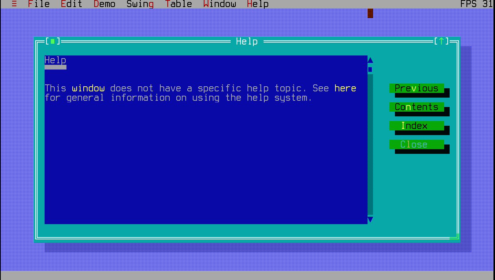
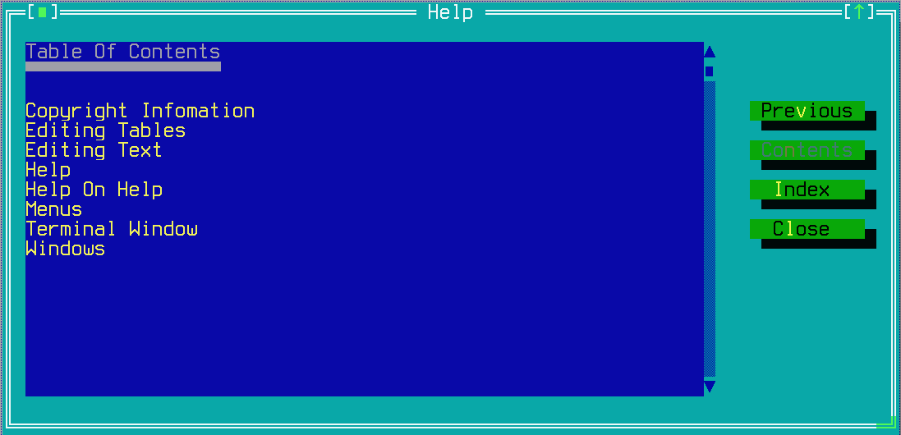
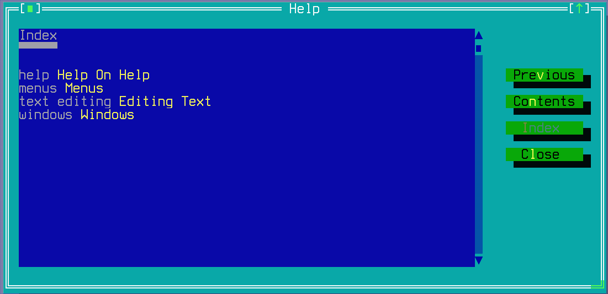

THelpWindow
===========

THelpWindow is a simple text-only browser of available help topics
with support for links to other pages and index keywords. It reflows
automatically on resize.

*Note that unlike the rest of Jexer, help text is **not** localized.*

When the user selects Help via drop-down menu item, status bar click,
or keyboard command (generally F1), the help topic assigned to the
*current active window* is what is brought up in the help browser.

To use custom help text in a new application:

1. Write a new XML file following the format described below.

2. In the TApplication subclass, set `helpTopics` and `helpFile` as
   shown below to use the new XML file.

3. In different TWindow subclasses, set `helpTopic` (or override
   `getHelpTopic()`) to use the topic appropriate to that window type.


Screenshots
-----------

The main help window is shown below:



The automatically-generated `Table of Contents` page is shown below:



The automatically-generated `Index` page is shown below:



Text File Format
----------------

A simple example help file is provided in [resources/help.xml](
https://gitlab.com/AutumnMeowMeow/jexer/-/raw/master/resources/help.xml?ref_type=heads).  An extract of that is below:

```XML
<?xml version="1.0" encoding="UTF-8"?>

<help>
  <name>Jexer Help File</name>
  <author>Autumn Lamonte</author>
  <version>1.0.0</version>
  <date>Jan 1, 2020</date>

  <topics>

    <topic title="Help">
      <text>
        This [window](Windows) does not have a specific help topic.
        See [here](Help On Help) for general information on using the
        help system.
      </text>
    </topic>

    <topic title="Help On Help">
      <text>
        The #{help} system...

      </text>
    </topic>

    <topic title="Copyright Infomation">
      <text>
        Copyright (C) 2022 Autumn Lamonte

        Available to all under the MIT License.
    </text>
</topic>

  </topics>
</help>

```

The XML file defines a bit of metadata (name/author/version/date)
followed by a list of `topics`:

* Each `topic` has a single `title` attribute, and a `text` element.

* The `text` element contains paragraphs of UTF-8-encoded text.
  Paragraphs are separated by a blank line.  *The text does **not**
  support general-purpose HTML/XML formatting,* it is just a plain
  list of paragraphs.

* The `text` element can optionally contain only these two kinds of
  inline markup: index entries, and links to other topics.

  - Index entries are denoted by `#{index entry text}`.  Whatever is
    in between the `#{` and `}` will be automatically added to the
    "Index" help topic.

  - Links are denoted by `[words in the text](topic title)` (like
    Markdown).  `words in the text` will be shown inline with text in
    a different color.  When clicked on, or selected via keyboard and
    Enter is pressed, the `topic title` page will be displayed.

Two special pages are generated automatically:

* The "Table of Contents" page is an alpabetically-sorted list of all
  topic titles.

* The "Index" page is an alphabetically-sorted list of all the index
  entries across all topics.

Examples
--------

After editing the help XML file, it can be used by a TApplication
subclass via:

```Java
helpTopics = new ArrayList<Topic>();
helpFile = new HelpFile();
helpFile.load(new FileInputStream(filename));
```

(In practice it may be easiest to simply replace `resources/help.xml`
with the new version.)

A TWindow subclass can either set its local `helpTopic` variable, or
override `getHelpTopic()`, to select which topic will be brought up
when that window is the active window.

API
---

[THelpWindow API](https://jexer.sourceforge.io/apidocs/api/jexer/THelpWindow.html)

😻
